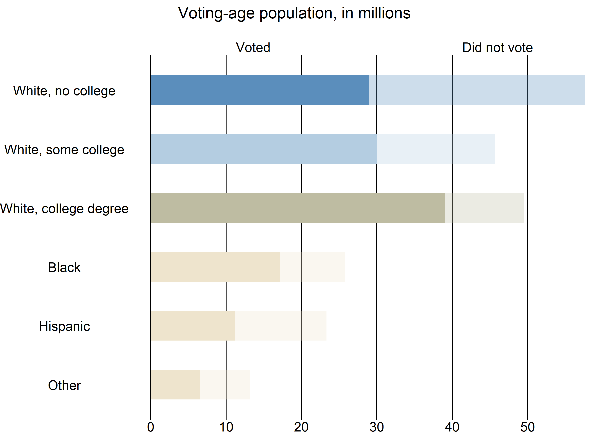
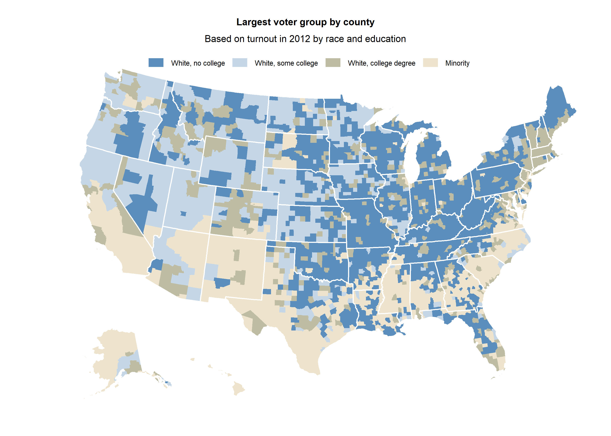

Donald Trump's Big Bet on Less Educated - NY Times
================
Christopher Oh
2018-12-27

-   [Motivation](#motivation)
-   [Challenges](#challenges)
-   [Packages, parameters, functions](#packages-parameters-functions)
-   [Datasets](#datasets)
-   [2012 CPS november data processing](#cps-november-data-processing)
-   [Aggregate voter turnout information](#aggregate-voter-turnout-information)
-   [Geo-visualization of the largest voter group by county](#geo-visualization-of-the-largest-voter-group-by-county)
    -   [Turnout rates calculation by race / education groups](#turnout-rates-calculation-by-race-education-groups)
    -   [Voting-age population calculations](#voting-age-population-calculations)
    -   [Visualization of the lagest voter group by county](#visualization-of-the-lagest-voter-group-by-county)

Motivation
----------

The goal is to reproduce one of the best visualizations on the 2016 US presidential election that correctly predicted how the demographics within each county could be the key in determining the election outcome.

Leveraging the power of the `tidyverse` and `sf` packages, I replicated the map that closely matches the original plot.

Challenges
----------

The two biggest hurdles to the project were:

-   Obtaining the right datasets
-   Tracing the steps the author took

The article provided minimal guidance regarding both aspects, so a lot of time and effort was dedicated on rummaging through the internet for the sources and verifying the metrics in each step of the calculation.

Below two sections of the article provided me with some guidance:

"Sources: Current Population Survey, 2012, Minnesota Population Center, University of Minnesota; Census Bureau American Community Survey; exit polls from Edison/Mitofsky, Voter News Services, Voter Research and Surveys, and The New York Times and CBS News" - Ford Fessenden, NYTimes [1]

"White educational-attainment populations calculated based on proportions in the over-25 population applied to voting-age population. Turnout is calculated for each of seven race-education groups (white, no college; white, some college; white, college degree; Hispanic; black; Asian-American; and other) at the state level, and applied to county voting-age population." - Ford Fessenden, NYTimes [2].

Packages, parameters, functions
-------------------------------

Pacakges used

``` r
library(tidyverse)
```

    ## Warning: package 'tidyverse' was built under R version 3.5.1

    ## -- Attaching packages -------------------------------------------------------------------------------- tidyverse 1.2.1 --

    ## √ ggplot2 3.1.0     √ purrr   0.2.5
    ## √ tibble  1.4.2     √ dplyr   0.7.8
    ## √ tidyr   0.8.2     √ stringr 1.3.1
    ## √ readr   1.2.1     √ forcats 0.3.0

    ## Warning: package 'ggplot2' was built under R version 3.5.1

    ## Warning: package 'tidyr' was built under R version 3.5.1

    ## Warning: package 'readr' was built under R version 3.5.1

    ## Warning: package 'dplyr' was built under R version 3.5.1

    ## -- Conflicts ----------------------------------------------------------------------------------- tidyverse_conflicts() --
    ## x dplyr::filter() masks stats::filter()
    ## x dplyr::lag()    masks stats::lag()

``` r
library(sf)
```

    ## Warning: package 'sf' was built under R version 3.5.1

    ## Linking to GEOS 3.6.1, GDAL 2.2.3, PROJ 4.9.3

Below are the parameters & functions to be used.

``` r
# CRS for US Albers 
US_ALBERS <-
  "+proj=aea +lat_1=29.5 +lat_2=45.5 +lat_0=37.5 +lon_0=-96 +x_0=0 +y_0=0 +datum=WGS84 +no_defs"
# CRS for Alaska
CRS_ALASKA <- "+proj=aea +lat_1=55 +lat_2=65 +lat_0=50 +lon_0=-154 +x_0=0 +y_0=0 +ellps=GRS80 +towgs84=0,0,0,0,0,0,0 +units=m +no_defs "
# CRS for Hawaii
CRS_HAWAII <- "+proj=aea +lat_1=8 +lat_2=18 +lat_0=13 +lon_0=-157 +x_0=0 +y_0=0 +datum=NAD83 +units=m +no_defs"

# Colors for map, graph

# Colors for the aggregate graph
AGG_V_COLOR <- c(
  no_college_white = "#5b8ebc",
  some_college_white = "#b4cde1",
  college_white = "#bebca2",
  black = "#eee4cd",
  hispanic = "#eee4cd",
  other = "#eee4cd"
)

# Map color
NYT_MAP_COLOR <- c(
  white_no_turnout = "#5b8ebc",
  white_some_turnout = "#c5d7e7",
  white_col_turnout = "#bebca2",
  minority_turnout = "#eee4cd"
)

# Legend color
NYT_LEGEND_COLOR <- c(
  "#5b8ebc",
  "#c5d7e7",
  "#bebca2",
  "#eee4cd"
)

# Labels for map, graph

# Aggregate graph labels
AGG_LABEL <- c(
  "Other",
  "Hispanic",
  "Black",
  "White, college degree",
  "White, some college",
  "White, no college"
)

# Map labels
NYT_MAP_LABEL <- c(
  "White, no college",
  "White, some college",
  "White, college degree",
  "Minority"
)

# Reads in and sets the labels for variables in county class and people dataset
set_label <- function(path) {
  headers <- read_csv(path, n_max = 2, col_names = FALSE)
  data <- read_csv(path, skip = 2, col_names = FALSE)
  for (i in seq_len(ncol(headers))) {
    colnames(data)[i] <- headers[[i]][[1]]
    attr(data[[i]], "label") <- headers[[i]][[2]]
  }
  data
}

# Collapses rows - numeric entries of "removed" gets absorbed into "combined"
collapse_rows <- function(df, removed, combined) {
  is_num <-
    df %>% 
    map_lgl(is.numeric)
  
  df[df$race_ff == combined, is_num] <-
  df[df$race_ff == combined, is_num] +
  df[df$race_ff == removed, is_num]
  
  df %>% 
  filter(race_ff != removed)
}

# Function for translating geometry
# Adapted to take into account just the state centroid
# Original: https://github.com/clauswilke/dviz.supp/blob/master/data-raw/tidy_census/US_income.R
place_geometry <- function(geometry, position, scale = 1) {
  centroid = st_combine(geometry) %>% st_centroid()
  (geometry - centroid) * scale + 
    st_sfc(st_point(position))
}
```

Datasets
--------

-   `county_geo`: County geometries\*
-   `state_geo`: State geometries\*
-   `cps_nov`: Variables extracted from Current Population Survey (CPS) and the November supplement containing voting information (both from year 2012) - queried from [IPUMS USA](https://usa.ipums.org/usa/)\*\*
-   `voting_age`: Voting age population data for each county in the U.S. from [US Census Bureau - Voting Age Population by Citizenship and Race](https://www.census.gov/rdo/data/voting_age_population_by_citizenship_and_race_cvap.html)
-   `white_edu`: County-level educational attainment data for 25 or older [American Community Survey (ACS) Educational Attainment Data - White Alone, Not Hispanic or Latino](https://factfinder.census.gov/faces/tableservices/jsf/pages/productview.xhtml?pid=ACS_16_1YR_C15002H&prodType=table)

\*Alaska and Hawaii are repositioned to be displayed by the projection used by other 48 states. Credit goes to Claus Wilke whose code was slightly modified to accomplish this task [3].

\*\*The .csv file imported was processed from the raw format (.dat file) using the provided STATA .do file from IPUMS (slightly modified to keep the state FIPS).

``` r
# Geographical data
county_rest <-
  read_rds(path_county_geo) %>% 
  filter(!STATEFP %in% c("02" ,"15")) %>% 
  mutate(county_fips = as.integer(GEOID)) %>% 
  st_transform(crs = US_ALBERS) 

# Bounding box coordinates of the 48 contiguous states
county_coord <-
  st_bbox(county_rest)


county_alaska <-
  read_rds(path_county_geo) %>%
  filter(STATEFP %in% "02") %>% 
  mutate(county_fips = as.integer(GEOID)) %>% 
  st_transform(crs = CRS_ALASKA)

st_geometry(county_alaska) <-
  place_geometry(
    st_geometry(county_alaska),
    c(county_coord$xmin + 0.08*(county_coord$xmax - county_coord$xmin),
      county_coord$ymin + 0.07*(county_coord$ymax - county_coord$ymin)),
    scale = .35
  )

st_crs(county_alaska) <- US_ALBERS


county_hawaii <-
  read_rds(path_county_geo) %>%
  filter(STATEFP %in% "15") %>% 
  mutate(county_fips = as.integer(GEOID)) %>% 
  st_transform(crs = CRS_HAWAII)

st_geometry(county_hawaii) <-
  place_geometry(
    st_geometry(county_hawaii),
    c(county_coord$xmin + 0.3*(county_coord$xmax - county_coord$xmin),
      county_coord$ymin)
  )

st_crs(county_hawaii) <- US_ALBERS

county_geo <-
  county_rest %>% 
  rbind(county_alaska, county_hawaii)

state_rest <-
  read_rds(path_state_geo) %>% 
  filter(!STATEFP %in% c("02", "15")) %>% 
  mutate(state_fips = STATEFP %>% as.integer()) %>% 
  st_transform(US_ALBERS)

state_alaska <-
  read_rds(path_state_geo) %>%
  filter(STATEFP %in% "02") %>% 
  mutate(state_fips = as.integer(GEOID)) %>% 
  st_transform(crs = CRS_ALASKA)

st_geometry(state_alaska) <-
  place_geometry(
    st_geometry(state_alaska),
    c(county_coord$xmin + 0.08*(county_coord$xmax - county_coord$xmin),
      county_coord$ymin + 0.07*(county_coord$ymax - county_coord$ymin)),
    scale = .35
  )

st_crs(state_alaska) <- US_ALBERS


state_hawaii <-
  read_rds(path_state_geo) %>%
  filter(STATEFP %in% "15") %>% 
  mutate(state_fips = as.integer(GEOID)) %>% 
  st_transform(crs = CRS_HAWAII)

st_geometry(state_hawaii) <-
  place_geometry(
    st_geometry(state_hawaii),
    c(county_coord$xmin + 0.3*(county_coord$xmax - county_coord$xmin),
      county_coord$ymin)
  )

st_crs(state_hawaii) <- US_ALBERS

state_geo <-
  state_rest %>% 
  rbind(state_alaska, state_hawaii)

# CPS Survey data
cps_nov <- read_csv(path_cps_nov)

# Voting age population data
voting_age <- 
  read_csv(path_voting_age) %>% 
  mutate(county_fips = GEOID %>% str_extract("\\d{5}$") %>% as.integer())

# White education data
white_edu <- 
  set_label(path_white_edu) %>%
  mutate(county_fips = GEO.id2 %>% as.integer()) 
  #filter(!(county_fips %/% 1000) %in% c(2, 15))
```

2012 CPS november data processing
---------------------------------

Most of the processing here is on collapsing the character variables into the desired levels.

Here are the steps:

1.  The entries with invlaid voting record are removed.
2.  `education` is collapsed into 3 levels: `no_college`, `some_college`, and `college`.
3.  `hispanic` is collapsed down to 2 levels: `hispanic`, `not_hispanic`.
4.  `race` is collpased down to 4 levels: `asian`, `black`, `other`, and `white`.
5.  Add a new level on `race` for the hispanics and assign everyone into this category regardless of their existing `race` level (i.e. a person's `race` is `hispanic` if the variable `hispanic` is `hispanic`). This is because hispanic is assigned as one of the race groups in the analysis by NY Times.

``` r
cps_nov_clean <-
  cps_nov %>% 
  filter(
    !(votereg %in% c("NIU"))
    # Remove the ones with invalid votereg record
  ) %>%
  mutate(
    vote = ifelse(votereg == "Voted", 1L, 0L),
    educ_f =
      fct_collapse(
        educ,
        no_college = c(
          "High school diploma or equivalent",
          "Grades 5 or 6",              
          "Grades 7 or 8",                  
          "Grade 11",
          "Grade 9",                
          "Grades 1, 2, 3, or 4",               
          "None or preschool",              
          "Grade 10",                               
          "12th grade, no diploma"
        ),
        some_college = c(
          "Associate's degree, academic program",
          "Associate's degree, occupational/vocational program",
          "Some college but no degree"
        ),
        college = c(
          "Bachelor's degree",
          "Doctorate degree",
          "Master's degree",
          "Professional school degree"
        )
      ),
    hispan_f = 
      fct_collapse(
        hispan,
        hispanic = c(
          "Mexican",            
          "Central/South American",             
          "Dominican",          
          "Puerto Rican",               
          "Cuban"
        ),
        not_hispanic = c("Not Hispanic")
      ),
    race_f =
      fct_collapse(
        race,
        white = c("White"),
        black = c("Black/Negro"),
        asian = c("Asian only"),
        other = c(
          "American Indian/Aleut/Eskimo",               
          "White-American Indian",              
          "Black-American Indian",              
          "White-Black",                
          "American Indian-Hawaiian/Pacific Islander",              
          "White-Asian",                
          "White-American Indian-Hawaiian/Pacific Islander",
          "Hawaiian/Pacific Islander only",             
          "White-Hawaiian/Pacific Islander",                
          "Black-Asian",                
          "White-Black-American Indian",                
          "White-American Indian-Asian",                
          "Asian-Hawaiian/Pacific Islander",            
          "Four or five races, unspecified",                
          "White-Asian-Hawaiian/Pacific Islander",              
          "Black-Hawaiian/Pacific Islander",            
          "White-Black-American Indian-Asian",
          "White-Black-Asian",              
          "American Indian-Asian",              
          "White-Black--Hawaiian/Pacific Islander"
        )
      ),
    educ_f = educ_f %>% as.character(),
    race_f = race_f %>% as.character(),
    hispan_f = hispan_f %>% as.character(),
    race_ff = ifelse(hispan_f == "hispanic", hispan_f, race_f)
  )
```

Aggregate voter turnout information
-----------------------------------

Let's group the population into the following 7 race / education groups:

-   White, no college
-   White, some college
-   White, college degree (or higher)
-   Black
-   Hispanic
-   Other

Then, based on the weighted sums from the CPS survey data, we can estimate:

-   The total voting-eligible population for each race / education group.
-   The number of people who voted within each race / education group.

``` r
white_aggregate <-
  cps_nov_clean %>%
  group_by(educ_f, race_ff) %>%
  summarize(
   total = sum(wtfinl, na.rm = TRUE)
  ) %>%
  filter(race_ff == "white") %>% 
  unite(race_ff, educ_f, race_ff)

white_aggregate_vote <-
  cps_nov_clean %>%
  mutate(turnout = vote * wtfinl) %>% 
  group_by(educ_f, race_ff) %>%
  summarize(
   turnout = sum(turnout, na.rm = TRUE)
  ) %>%
  filter(race_ff == "white") %>% 
  unite(race_ff, educ_f, race_ff)

other_races_agg <-
  cps_nov_clean %>%
  group_by(race_ff) %>%
  summarize(
   total = sum(wtfinl, na.rm = TRUE)
  ) %>%
  filter(race_ff != "white")

other_races_agg_vote <-
  cps_nov_clean %>%
  mutate(turnout = vote * wtfinl) %>% 
  group_by(race_ff) %>%
  summarize(
   turnout = sum(turnout, na.rm = TRUE)
  ) %>%
  filter(race_ff != "white")

tot_vote <-
  white_aggregate_vote %>% 
  rbind(other_races_agg_vote)

total_pop <-
  white_aggregate %>% 
  rbind(other_races_agg)
```

With all the aggregated voting-age population size & turnout size for each race / education group, we can replicate the third plot in the article.

``` r
total_pop %>% 
  left_join(tot_vote, by = "race_ff") %>% 
  collapse_rows("asian", "other") %>% 
  mutate(
    race_ff =
      race_ff %>%
      forcats::fct_relevel(
        c("other",
          "hispanic",
          "black",
          "college_white",
          "some_college_white",
          "no_college_white"
        )
      ),
    total = total / 1e6,
    turnout = turnout / 1e6
  ) %>% 
  ggplot(aes(race_ff, total)) +
  geom_col(aes(fill = race_ff), alpha = .3, width = .5) +
  geom_col(aes(y = turnout, fill = race_ff), width = .5) +
  scale_y_continuous(breaks = seq(0, 50, 10)) +
  scale_x_discrete(labels = AGG_LABEL) +
  scale_fill_manual(values = AGG_V_COLOR) +
  labs(
    title = "Voting-age population, in millions",
    subtitle = "                     
                             Voted                                                    Did not vote",
    x = NULL,
    y = NULL
  ) +
  coord_flip() +
  theme_void() +
  theme(
    plot.title = element_text(hjust  = .2),
    legend.position = "none",
    axis.text = element_text(),
    panel.grid.major.x = element_line()
  )
```



Why this plot does not exactly match up with the one in the article is still a mystery, but it is fairly close.

Geo-visualization of the largest voter group by county
------------------------------------------------------

In this section, we finally delve into recreating the final map in the article that correctly predicted how Trump could possibly win the 2016 US presidential election.

The following subsections detail the process.

### Turnout rates calculation by race / education groups

I calculate the state-level turnout rates based on the 7 race / education groups which then would be applied on each county's voting-age population to estimated the turnouts.

``` r
white_only <-
  cps_nov_clean %>% 
  group_by(statefip, educ_f, race_ff) %>% 
  summarize(
    turnout = weighted.mean(vote, wtsupp)
  ) %>%
  filter(race_ff == "white") %>% 
  spread(educ_f, turnout) %>% 
  rename(
    white_college = college,
    white_no_college = no_college,
    white_some_college = some_college
  ) %>% 
  select(-race_ff)

other_races <-
  cps_nov_clean %>% 
  group_by(statefip, race_ff) %>% 
  summarize(
    turnout = weighted.mean(vote, wtsupp)
  ) %>%
  filter(race_ff != "white") %>% 
  spread(race_ff, turnout)

educ_race_turnouts <-
  white_only %>% 
  left_join(other_races, by = "statefip") %>% 
  rename(state_fips = statefip)
```

### Voting-age population calculations

1.  Since the original voting age population data is broken down just by race (`voting_age`), to get an approximate of the breakdown by education for the whites, a dataset that contains this information on population aged 25 or over was used (`white_edu`).
2.  Use the state-wide turnout rates derived above to calculate the estimates of the county-level turnouts for each of the 7 groups.
3.  The four minority race groups are aggregated into one.
4.  In each county, the demographic with the highest turnout is selected.

``` r
voting_age <-
  voting_age %>% 
  select(GEONAME, LNTITLE, CVAP_EST, county_fips) %>% 
  spread(LNTITLE, CVAP_EST) %>% 
  filter(!(county_fips %/% 1000) %in% c(72)) %>% 
  mutate(
    other_pop =
      `American Indian or Alaska Native Alone` +
      `American Indian or Alaska Native and Black or African American` +
      `American Indian or Alaska Native and White` +
      `Asian and White` +
      `Black or African American and White` +
      `Native Hawaiian or Other Pacific Islander Alone` +
      `Remainder of Two or More Race Responses`
  ) %>% 
  select(
    county_fips,
    GEONAME,
    asian_pop = `Asian Alone`,
    black_pop = `Black or African American Alone`,
    hispanic_pop = `Hispanic or Latino`,
    other_pop,
    white_pop = `White Alone`
  )

white_edu <-
  white_edu %>% 
  mutate(
    prop_w_no = (HD01_VD03 + HD01_VD04 + HD01_VD08 + HD01_VD09) / HD01_VD01,
    prop_w_some = (HD01_VD05 + HD01_VD10) / HD01_VD01,
    prop_w_col = (HD01_VD06 + HD01_VD11) / HD01_VD01
  ) %>% 
  select(
    county_fips,
    prop_w_no,
    prop_w_some,
    prop_w_col
  )

# Education breakdown of the white voting age population
voter_pop <-
  voting_age %>% 
  left_join(white_edu, by = "county_fips") %>% 
  mutate(
    white_no_pop = prop_w_no * white_pop,
    white_some_pop = prop_w_some * white_pop,
    white_col_pop = prop_w_col * white_pop
  ) %>% 
  select(-white_pop, -starts_with("prop_"))

# Turnout calculation based on the turnout rates by state
voter_turnout_est <-
  voter_pop %>% 
  mutate(state_fips = county_fips %/% 1000) %>% 
  left_join(educ_race_turnouts, by = "state_fips") %>% 
  mutate(
    asian_turnout = asian_pop * asian,
    black_turnout = black_pop * black,
    hispanic_turnout = hispanic_pop * hispanic,
    other_turnout = other_pop * other,
    white_no_turnout = white_no_pop * white_no_college,
    white_some_turnout = white_some_pop * white_some_college,
    white_col_turnout = white_col_pop * white_college
  ) %>% 
  select(
    county_fips,
    GEONAME,
    ends_with("_turnout")
  )

# Pick the demographic with the highest voter population for each county
voter_turnout_most <-
  voter_turnout_est %>% 
  mutate(
    minority_turnout = 
      asian_turnout + black_turnout + hispanic_turnout + other_turnout
  ) %>% 
  select(
    county_fips,
    GEONAME,
    starts_with("white_"),
    minority_turnout
  ) %>% 
  gather(
    turnout,
    value,
    white_no_turnout, white_some_turnout, white_col_turnout,
    minority_turnout
  ) %>%
  group_by(county_fips) %>%
  filter(value == max(value, na.rm = TRUE))
```

### Visualization of the lagest voter group by county

Recreation of the NY Times plot.

In general, this map explains how Trump could win the election.

The counties that are marked dark blue (where the primary voters are whites without college degree) tended to be the ones in which Trump won over other candidates.

``` r
voter_turnout_most %>% 
  left_join(county_geo, by = "county_fips") %>% 
  ggplot() +
  geom_sf(aes(fill = turnout), color = NA) +
  geom_sf(
    color = "white", size = .5, fill = NA,
    data = state_geo,
    inherit.aes = FALSE
  ) +
  coord_sf(crs = US_ALBERS, datum = NA) + 
  # coord_sf(crs = st_crs(state_geo), datum = NA) + 
  scale_fill_manual(
    values = NYT_MAP_COLOR,
    labels = NYT_MAP_LABEL
  ) +
  labs(
    title = "Largest voter group by county",
    subtitle = "Based on turnout in 2012 by race and education"
  ) +
  guides(
    fill =
    guide_legend(
      title = NULL,
      label.theme = element_text(size = 6, angle = 0),
      keywidth = .95,
      keyheight = .6,
      label.position = "right",
      label.hjust = 0,
      nrow = 1,
      direction = "horizontal",
      override.aes = list(fill = NYT_LEGEND_COLOR)
    )
  ) +
  theme(
    legend.position = c(0.5, .97),
    plot.title = element_text(size = 8, face = "bold", hjust = .5),
    plot.subtitle = element_text(size = 8, hjust = .5),
    rect = element_blank()
  )
```



[1] Ford Fessenden. New York Times. [Donald Trump's Big Bet on Less Educated Whites](https://www.nytimes.com/interactive/2016/11/07/us/how-trump-can-win.html)

[2] Ford Fessenden. New York Times. [Donald Trump's Big Bet on Less Educated Whites](https://www.nytimes.com/interactive/2016/11/07/us/how-trump-can-win.html)

[3] Claus Wilke's code for repositioning / rescaling Alaska & hawaii [US\_income.R](https://github.com/clauswilke/dviz.supp/blob/master/data-raw/tidy_census/US_income.R)
