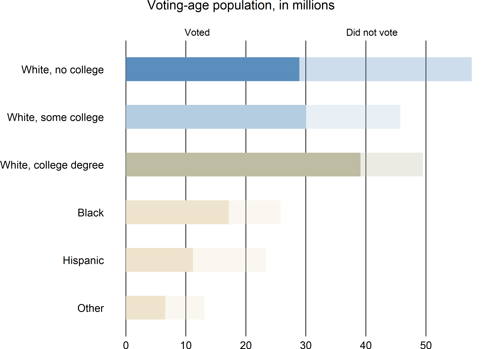
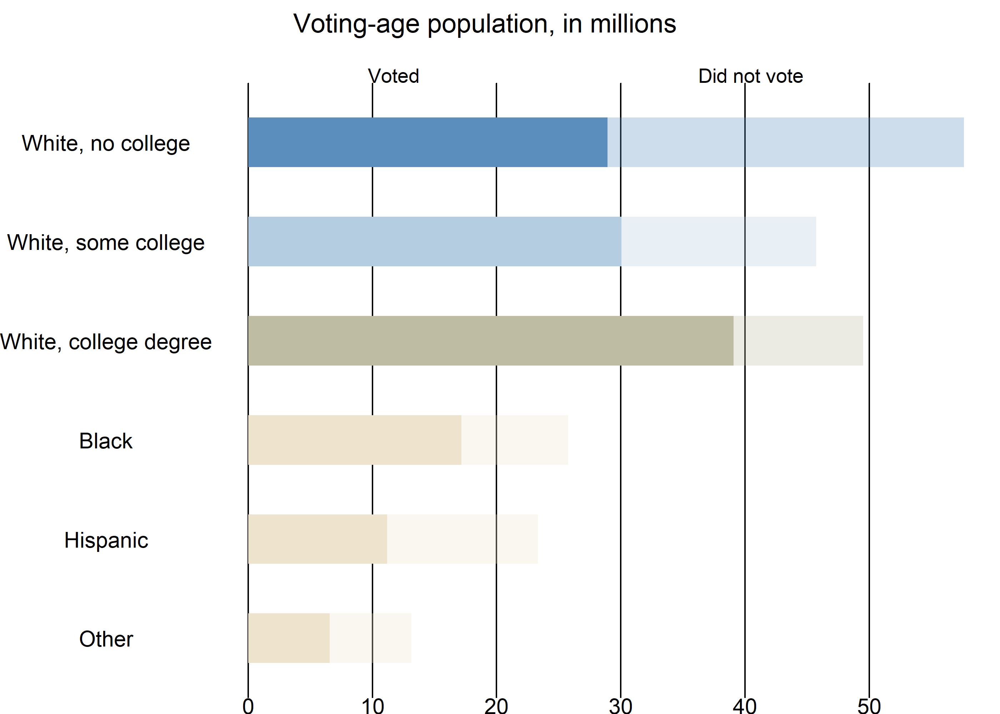

NYT Recreation - Donald Trump's Big Bet on Less Educated
================
Christopher Oh
2017-08-28

-   [Motivation](#motivation)
-   [0 Parameters](#parameters)
-   [1 Some Parsing](#some-parsing)
-   [2 Further processing on the 2012 CPS November data from IPUMS](#further-processing-on-the-2012-cps-november-data-from-ipums)
-   [3 Aggregates based on the CPS dataset](#aggregates-based-on-the-cps-dataset)
-   [4 Turnout rates calculation by race / education groups](#turnout-rates-calculation-by-race-education-groups)
-   [5 Voting\_age population calculations](#voting_age-population-calculations)
-   [6 Largest Voter Group By County Recreation](#largest-voter-group-by-county-recreation)

Motivation
----------

The eventual goal is to produce one of the best visualizations on the 2016 presidential election prediction.

From what I could gather based on the following description of the map, and scouting for the right datasets on the web based on the sources (which were unfortunately did not provide much guidance as to where to find them), I put together a replica of the plot, which does not match up perfectly with the NY Times plot, but nonetheless comes quite close.

"White educational-attainment populations calculated based on proportions in the over-25 population applied to voting-age population. Turnout is calculated for each of seven race-education groups (white, no college; white, some college; white, college degree; Hispanic; black; Asian-American; and other) at the state level, and applied to county voting-age population." Ford Fessenden, NYTimes [1].

0 Parameters
------------

``` r
# File paths

# 2012 CPS November survey data that contains the voting turnout rate information
path_cps_nov <- "C:/Users/logicalfellac/Downloads/cps_00003.dat/cps_00003_1.csv"

# Voting age population data broken down by race
path_voting_age <- "C:/Users/logicalfellac/Downloads/Spring2017/C01/County.csv"

# White (not hispanic) population over 25 divided by educational attainment
path_white_edu <- "C:/Users/logicalfellac/Downloads/Spring2017/C01/ACS_15_5YR_C15002H_with_ann.csv"

# Geodata
path_county_geo <- "C:/Users/logicalfellac/Downloads/Spring2017/C01/cb_2015_us_county_20m_sf.rds" 
path_state_geo <- "C:/Users/logicalfellac/Downloads/Spring2017/C01/cb_2015_us_state_20m_sf.rds"

# Parameters

# CRS for US Albers 
US_ALBERS <- "+proj=aea +lat_1=29.5 +lat_2=45.5 +lat_0=37.5 +lon_0=-96 +x_0=0 +y_0=0 +datum=WGS84 +no_defs"

# Colors for map, graph

# Colors for the aggregate graph
AGG_V_COLOR <- c(
  no_college_white = "#5b8ebc",
  some_college_white = "#b4cde1",
   college_white = "#bebca2",
  black = "#eee4cd",
  hispanic = "#eee4cd",
  other = "#eee4cd"
)

# Map color
NYT_MAP_COLOR <- c(
  white_no_turnout = "#5b8ebc",
  white_some_turnout = "#c5d7e7",
  white_col_turnout = "#bebca2",
  minority_turnout = "#eee4cd"
)

# Legend color
NYT_LEGEND_COLOR <- c(
  "#5b8ebc",
  "#c5d7e7",
  "#bebca2",
  "#eee4cd"
)

# Labels for map, graph

# Aggregate graph labels
AGG_LABEL <- c(
  "Other",
  "Hispanic",
  "Black",
  "White, college degree",
  "White, some college",
  "White, no college"
)

# Map labels
NYT_MAP_LABEL <- c(
  "White, no college",
  "White, some college",
  "White, college degree",
  "Minority"
)

# Reads in and sets the labels for variables in county class and people dataset
set_label <- function(path) {
  headers <- read_csv(path, n_max = 2, col_names = FALSE)
  data <- read_csv(path, skip = 2, col_names = FALSE)
  for (i in seq_len(ncol(headers))) {
    colnames(data)[i] <- headers[[i]][[1]]
    attr(data[[i]], "label") <- headers[[i]][[2]]
  }
  data
}

# Collapses rows - numeric entries of "removed" gets absorbed into "combined"
collapse_rows <- function(df, removed, combined) {
  is_num <-
    df %>% 
    map_lgl(is.numeric)
  
  df[df$race_ff == combined, is_num] <-
  df[df$race_ff == combined, is_num] +
  df[df$race_ff == removed, is_num]
  
  df %>% 
  filter(race_ff != removed)
}
```

1 Some Parsing
--------------

\*Alaska and Hawaii are excluded to avoid complications with geovisualization.

``` r
# Geographical data
county_geo <-
  read_rds(path_county_geo) %>% 
  filter(!STATEFP %in% c("02" ,"15")) %>% 
  mutate(county_fips = as.integer(GEOID)) %>% 
  st_transform(crs = US_ALBERS) 

state_geo <-
  read_rds(path_state_geo) %>% 
  filter(!STATEFP %in% c("02", "15")) %>% 
  mutate(state_fips = STATEFP %>% as.integer()) %>% 
  st_transform(US_ALBERS)


# CPS Survey data
cps_nov <- read_csv(path_cps_nov)


# Voting age population data
voting_age <- 
  read_csv(path_voting_age) %>% 
  mutate(county_fips = GEOID %>% str_extract("\\d{5}$") %>% as.integer())

# White education data
white_edu <- 
  set_label(path_white_edu) %>%
    mutate(county_fips = GEO.id2 %>% as.integer()) %>% 
    filter(!(county_fips %/% 1000) %in% c(2, 15))
```

2 Further processing on the 2012 CPS November data from IPUMS
-------------------------------------------------------------

The .csv file imported was process from the raw format (.dat file) using the provided STATA command through IPUMS.

Most of the additional processing here is on collapsing the character variables into desired levels.

First, the entries with invlaid voting record are removed.

`education` is collapsed into 3 levels: `no_college`, `some_college`, and `college`.

`hispanic` is collapsed down to 2 levels: `hispanic`, `not_hispanic`.

`race` is collpased down to 4 levels: `asian`, `black`, `other`, and `white`.

Since hispanic is treated as one of the race groups in the analysis by NY Times, we replicate this by creating a new column that treats everyone that is `hispanic` for the `hispanic` column as `hispanic` and the rest as their respective `race` levels (1 of the 4 mentioned above).

``` r
cps_nov_clean <-
  cps_nov %>% 
  filter(
    !(votereg %in% c("NIU"))
    # Remove the ones with invalid votereg record
  ) %>%
  mutate(
    vote = ifelse(votereg == "Voted", 1L, 0L),
    educ_f =
      fct_collapse(
        educ,
        no_college = c(
          "High school diploma or equivalent",
          "Grades 5 or 6",              
          "Grades 7 or 8",                  
          "Grade 11",
          "Grade 9",                
          "Grades 1, 2, 3, or 4",               
          "None or preschool",              
          "Grade 10",                               
          "12th grade, no diploma"
        ),
        some_college = c(
          "Associate's degree, academic program",
          "Associate's degree, occupational/vocational program",
          "Some college but no degree"
        ),
        college = c(
          "Bachelor's degree",
          "Doctorate degree",
          "Master's degree",
          "Professional school degree"
        )
      ),
    hispan_f = 
      fct_collapse(
        hispan,
        hispanic = c(
          "Mexican",            
          "Central/South American",             
          "Dominican",          
          "Puerto Rican",               
          "Cuban"
        ),
        not_hispanic = c("Not Hispanic")
      ),
    race_f =
      fct_collapse(
        race,
        white = c("White"),
        black = c("Black/Negro"),
        asian = c("Asian only"),
        other = c(
          "American Indian/Aleut/Eskimo",               
          "White-American Indian",              
          "Black-American Indian",              
          "White-Black",                
          "American Indian-Hawaiian/Pacific Islander",              
          "White-Asian",                
          "White-American Indian-Hawaiian/Pacific Islander",
          "Hawaiian/Pacific Islander only",             
          "White-Hawaiian/Pacific Islander",                
          "Black-Asian",                
          "White-Black-American Indian",                
          "White-American Indian-Asian",                
          "Asian-Hawaiian/Pacific Islander",            
          "Four or five races, unspecified",                
          "White-Asian-Hawaiian/Pacific Islander",              
          "Black-Hawaiian/Pacific Islander",            
          "White-Black-American Indian-Asian",
          "White-Black-Asian",              
          "American Indian-Asian",              
          "White-Black--Hawaiian/Pacific Islander"
        )
      ),
    educ_f = educ_f %>% as.character(),
    race_f = race_f %>% as.character(),
    hispan_f = hispan_f %>% as.character(),
    race_ff = ifelse(hispan_f == "hispanic", hispan_f, race_f)
  )
```

3 Aggregates based on the CPS dataset
-------------------------------------

Here the goal is to recreate the aggregate plot for voting age populatino and the actual turnout.

Notice that the values for hispanics match up perfectly, while `White, college degree` and `Other` are way off compared to the original plot in the article.

Specifically, `White, college degree` population and turnout are over-reported, while the `Other` population and turnout are under-reported here.

``` r
white_aggregate <-
  cps_nov_clean %>%
  group_by(educ_f, race_ff) %>%
  summarize(
   total = sum(wtfinl, na.rm = TRUE)
  ) %>%
  filter(race_ff == "white") %>% 
  unite(race_ff, educ_f, race_ff)

white_aggregate_vote <-
  cps_nov_clean %>%
  mutate(turnout = vote * wtfinl) %>% 
  group_by(educ_f, race_ff) %>%
  summarize(
   turnout = sum(turnout, na.rm = TRUE)
  ) %>%
  filter(race_ff == "white") %>% 
  unite(race_ff, educ_f, race_ff)

other_races_agg <-
  cps_nov_clean %>%
  group_by(race_ff) %>%
  summarize(
   total = sum(wtfinl, na.rm = TRUE)
  ) %>%
  filter(race_ff != "white")

other_races_agg_vote <-
  cps_nov_clean %>%
  mutate(turnout = vote * wtfinl) %>% 
  group_by(race_ff) %>%
  summarize(
   turnout = sum(turnout, na.rm = TRUE)
  ) %>%
  filter(race_ff != "white")

tot_vote <-
  white_aggregate_vote %>% 
  rbind(other_races_agg_vote)

total_pop <-
  white_aggregate %>% 
  rbind(other_races_agg)

total_pop %>% 
  left_join(tot_vote, by = "race_ff") %>% 
  collapse_rows("asian", "other") %>% 
  mutate(
    race_ff =
      race_ff %>%
      forcats::fct_relevel(
        c("other",
          "hispanic",
          "black",
          "college_white",
          "some_college_white",
          "no_college_white"
        )
      ),
    total = total / 1e6,
    turnout = turnout / 1e6
  ) %>% 
  ggplot(aes(race_ff, total)) +
  geom_col(aes(fill = race_ff), alpha = .3, width = .5) +
  geom_col(aes(y = turnout, fill = race_ff), width = .5) +
  scale_y_continuous(breaks = seq(0, 50, 10)) +
  scale_x_discrete(labels = AGG_LABEL) +
  scale_fill_manual(values = AGG_V_COLOR) +
  labs(
    title = "Voting-age population, in millions",
    subtitle = "                     
                             Voted                                                    Did not vote",
    x = NULL,
    y = NULL
  ) +
  coord_flip() +
  theme_void() +
  theme(
    plot.title = element_text(hjust  = .2),
    legend.position = "none",
    axis.text = element_text(),
    panel.grid.major.x = element_line()
  )
```



4 Turnout rates calculation by race / education groups
------------------------------------------------------

I calculate the turnout rates based on the 7 race / education groups from the process CPS Survey dataset.

``` r
white_only <-
  cps_nov_clean %>% 
  group_by(statefip, educ_f, race_ff) %>% 
  summarize(
    turnout = weighted.mean(vote, wtsupp)
  ) %>%
  filter(race_ff == "white") %>% 
  spread(educ_f, turnout) %>% 
  rename(
    white_college = college,
    white_no_college = no_college,
    white_some_college = some_college
  ) %>% 
  select(-race_ff)

other_races <-
  cps_nov_clean %>% 
  group_by(statefip, race_ff) %>% 
  summarize(
      turnout = weighted.mean(vote, wtsupp)
  ) %>%
  filter(race_ff != "white") %>% 
  spread(race_ff, turnout)

educ_race_turnouts <-
  white_only %>% 
  left_join(other_races, by = "statefip") %>% 
  rename(state_fips = statefip)
```

5 Voting\_age population calculations
-------------------------------------

As mentioned earlier, the voting age population is broken down into 7 race / education groups.

Since the original voting age population data is broken down just by race, to get an approximate of the breakdown by education for the whites, a dataset that contains this information on population aged 25 or over had to be used.

Then, when this dataset is joined with the turnout rates dataset derived above, we can calculate the estimate of the turnouts for each of the 7 groups.

Then, the four minority race groups are collapsed into one, after which the demographic with the highest turnout is picked for each county.

``` r
voting_age <-
  voting_age %>% 
  select(GEONAME, LNTITLE, CVAP_EST, county_fips) %>% 
  spread(LNTITLE, CVAP_EST) %>% 
  filter(!(county_fips %/% 1000) %in% c(2, 15, 72)) %>% 
  mutate(
    other_pop =
      `American Indian or Alaska Native Alone` +
      `American Indian or Alaska Native and Black or African American` +
      `American Indian or Alaska Native and White` +
      `Asian and White` +
      `Black or African American and White` +
      `Native Hawaiian or Other Pacific Islander Alone` +
      `Remainder of Two or More Race Responses`
  ) %>% 
  select(
    county_fips,
    GEONAME,
    asian_pop = `Asian Alone`,
    black_pop = `Black or African American Alone`,
    hispanic_pop = `Hispanic or Latino`,
    other_pop,
    white_pop = `White Alone`
  )

white_edu <-
  white_edu %>% 
  mutate(
    prop_w_no = (HD01_VD03 + HD01_VD04 + HD01_VD08 + HD01_VD09) / HD01_VD01,
    prop_w_some = (HD01_VD05 + HD01_VD10) / HD01_VD01,
    prop_w_col = (HD01_VD06 + HD01_VD11) / HD01_VD01
  ) %>% 
  select(
    county_fips,
    prop_w_no,
    prop_w_some,
    prop_w_col
  )

# Education breakdown of the white voting age population
voter_pop <-
  voting_age %>% 
  left_join(white_edu, by = "county_fips") %>% 
  mutate(
    white_no_pop = prop_w_no * white_pop,
    white_some_pop = prop_w_some * white_pop,
    white_col_pop = prop_w_col * white_pop
  ) %>% 
  select(-white_pop, -starts_with("prop_"))

# Turnout calculation based on the turnout rates by state
voter_turnout_est <-
  voter_pop %>% 
  mutate(state_fips = county_fips %/% 1000) %>% 
  left_join(educ_race_turnouts, by = "state_fips") %>% 
  mutate(
    asian_turnout = asian_pop * asian,
    black_turnout = black_pop * black,
    hispanic_turnout = hispanic_pop * hispanic,
    other_turnout = other_pop * other,
    white_no_turnout = white_no_pop * white_no_college,
    white_some_turnout = white_some_pop * white_some_college,
    white_col_turnout = white_col_pop * white_college
  ) %>% 
  select(
    county_fips,
    GEONAME,
    ends_with("_turnout")
  )

# Pick the demographic with the highest voter population for each county
voter_turnout_most <-
  voter_turnout_est %>% 
  mutate(
    minority_turnout = 
      asian_turnout + black_turnout + hispanic_turnout + other_turnout
  ) %>% 
  select(
    county_fips,
    GEONAME,
    starts_with("white_"),
    minority_turnout
  ) %>% 
  gather(
    turnout,
    value,
    white_no_turnout, white_some_turnout, white_col_turnout,
    minority_turnout
  ) %>%
  group_by(county_fips) %>%
  filter(value == max(value, na.rm = TRUE))
```

    ## Warning: attributes are not identical across measure variables; they will
    ## be dropped

6 Largest Voter Group By County Recreation
------------------------------------------

Recreation of the NY Times plot!

Unfortunately, it does not match up perfectly with the original plot, but it is fairly close.

``` r
voter_turnout_most %>% 
  left_join(county_geo, by = "county_fips") %>% 
  ggplot() +
  geom_sf(
    aes(fill = turnout),
    color = NA
  ) +
  geom_sf(color = "white", size = .5, fill = NA, data = state_geo) +
  scale_fill_manual(
    values = NYT_MAP_COLOR,
    labels = NYT_MAP_LABEL
  ) +
  labs(
    title = "Largest voter group by county",
    subtitle = "Based on turnout in 2012 by race and education"
  ) +
  guides(
    fill =
    guide_legend(
      title = NULL,
      label.theme = element_text(size = 6, angle = 0),
      keywidth = .95,
      keyheight = .6,
      label.position = "right",
      label.hjust = 0,
      nrow = 1,
      direction = "horizontal",
      override.aes = list(fill = NYT_LEGEND_COLOR)
    )
  ) +
  theme_void() +
  theme(
    legend.position = c(0.5, .97),
    plot.title = element_text(size = 8, face = "bold", hjust = .5),
    plot.subtitle = element_text(size = 8, hjust = .5)
  )
```



[1] Ford Fessenden. New York Times. [Donald Trump's Big Bet on Less Educated Whites](https://www.nytimes.com/interactive/2016/11/07/us/how-trump-can-win.html)
